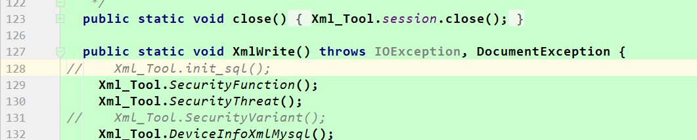
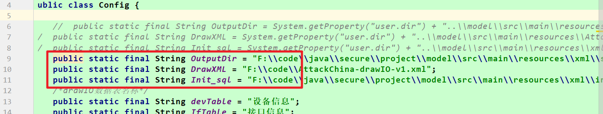
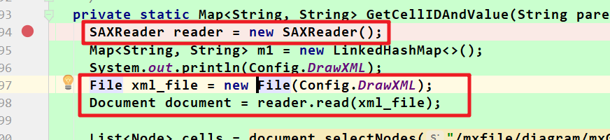

# 运行说明

## 代码改动

#### xml_tool启动不再执行init.sql



在每次解析数据之前，使用代码清空数据库数据

#### com.xml.Conf.Config使用了绝对路径



#### SAXReader

读取xml时，使用如下方式



#### mybatis jdbc配置独立配置文件

jdbc.properties

```properties
jdbc.driverClass=com.mysql.cj.jdbc.Driver
#jdbc.url=jdbc:mysql://106.52.238.185:3306/security?characterEncoding=utf8&serverTimezone=GMT
jdbc.url=jdbc:mysql://192.168.42.134:3307/security?characterEncoding=utf8&serverTimezone=GMT
jdbc.username=root
jdbc.password=wodemima
```

在mybatis相关配置文件中引用

```xml
<properties resource="jdbc.properties"/>
  <environments default="development">
    <environment id="development">
      <transactionManager type="JDBC"/>
      <dataSource type="POOLED">
        <property name="driver" value="${jdbc.driverClass}"/>
        <property name="url" value="${jdbc.url}"/>
        <property name="username" value="${jdbc.username}"/>
        <property name="password" value="${jdbc.password}"/>
      </dataSource>
    </environment>
  </environments>
```

## 项目目录

| 目录         | 说明                                              |
| ------------ | ------------------------------------------------- |
| docker_mysql | docker服务构建目录                                |
| frontend     | vue前端,已打包整合进javaweb，如有修改需要重新编译 |
| graph        | python绘图服务                                    |
| model        | attackgraph模块                                   |
| web          | java web模块（springboot）                        |

## 自定义的配置

在web模块的application.yml

python绘图服务的地址

```yaml
rest:
  plot-host-name: 127.0.0.1
  plot-host-port: 8000
  plot-graph-addr: http://${rest.plot-host-name}:${rest.plot-host-port}/getGraph/
```

在model模块，jdbc.properties制定了后端数据库

```properties
jdbc.driverClass=com.mysql.cj.jdbc.Driver
#jdbc.url=jdbc:mysql://106.52.238.185:3306/security?characterEncoding=utf8&serverTimezone=GMT
jdbc.url=jdbc:mysql://192.168.42.134:3307/security?characterEncoding=utf8&serverTimezone=GMT
jdbc.username=root
jdbc.password=wodemima
```

python绘图服务，数据库地址运行时均需修改为自己的地址

## 运行说明

### 数据库与绘图服务

docker_mysql目录是docker-compose构建目录，在该目录下执行

```
docker-compose up
```

docker会构建mysql、phpmyadmin、drawio以及python绘图服务

启动后，mysql服务运行在3307，用户名root，密码wodemima

phpmyadmin端口8080

ddrawio端口  http:8001,https:8443

访问http时`http://ip:8001/?https=0`

python绘图服务8002，由于构建的镜像缺少中文字体，画出的图会中文乱码，可以自己在本地运行python服务

### java服务

java服务牵涉到路径问题，暂时未打包，运行使用idea运行web模块的application.DemoApplication即可

